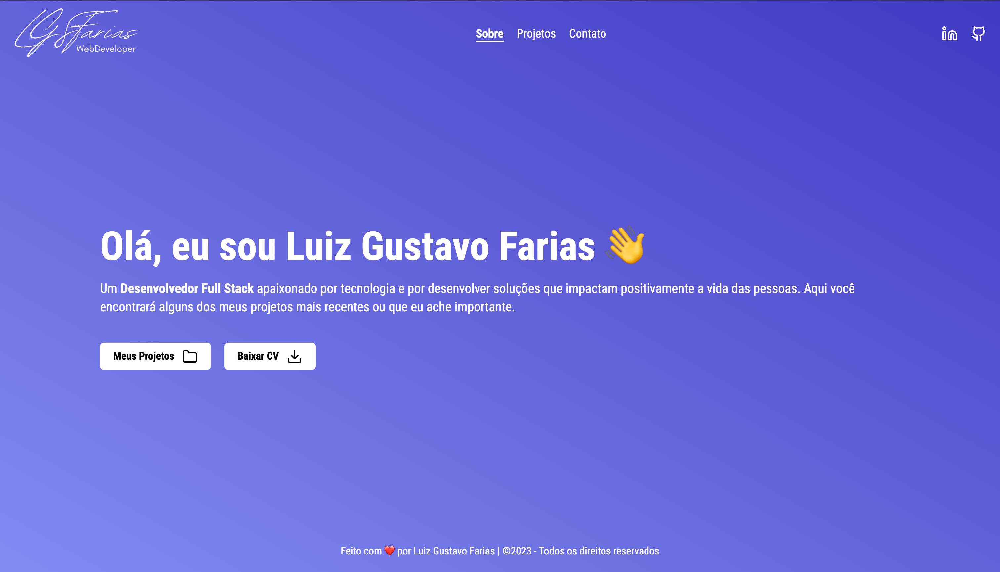

<p align="center">
  <a href="https://github.com/lgsfarias/portfolio">
    
  </a>

  <h3 align="center">
    LGSFarias | Portfolio
  </h3>
  <p align="center">
    Meu portfólio pessoal
    <br />
    <a href="https://github.com/lgsfarias/portfolio"><strong>Explore the docs »</strong></a>
    <br />
</p>

<br/>

<br/><br/>

<br/>

## 🎯 Objetivo

Este projeto foi desenvolvido com o objetivo de mostrar meus projetos e habilidades como desenvolvedor. Além disso pude aprimorar minhas habilidades com o Next.js e o Tailwind CSS.

<br/>

## ⛏️ Ferramentas utilizadas


<br/>

## 🚏 Routes

```
- /
  - Route to homepage
- /projects
  - Route to projects page
- /contact
  - Route to contact page
```

<br/>

## 🏁 instruções de instalação

Para rodar este projeto, você precisará instalar [Node.js](https://nodejs.org/en/).

Clone o repositório

```bash
git clone https://github.com/lgsfarias/portfolio.git
```

Accesse a pasta do projeto

```bash
cd portfolio
```

Preencha o arquivo .env com as variáveis de ambiente conforme o arquivo .env.example

```bash
cp .env.example .env
```

Instale as dependências

```bash
npm install
# ou
yarn
```

<br/>

## 🏃🏽 Como rodar o projeto

```bash
npm run dev
# ou
yarn dev
```

A aplicação estará disponível em [http://localhost:3000](http://localhost:3000)

<br/>

## 💻 Deploy

A aplicação está disponível em [https://lgsfarias.dev/](https://lgsfarias.dev/)

<br/>

## 📬 Contato

<div>
  <a href="https://www.linkedin.com/in/lgsfarias" target="_blank"></a>
  <a href = "mailto:lgsfarias.dev@gmail.com"></a>
</div>
